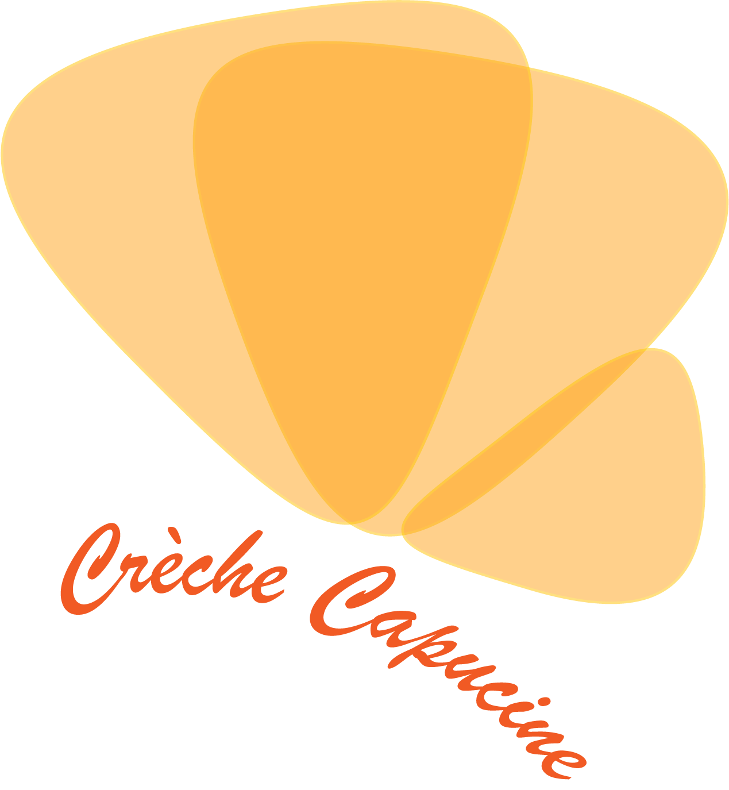

---
title: Association Capucine et papillons, jardin d'enfance
---

* [Site de l'association](http://www.creche-capucine-paris13.fr/)
* [Page Facebook](https://www.facebook.com/capucineetpapillons/)

# Capucine et papillons, jardin d'enfance

Le dépôt GitHub contient les documents historiques de l'association
jusqu'à 2018. À partir de 2019, les statuts, les règlements intérieurs
sont sous gestion de versions.

## Documents actuels

Les règlements intérieurs votés en Conseil d'administration, le 16
avril 2019, et ratifiés par l'Assemblée générale du 25 mai 2019.

* Le [règlement intérieur](RI_association) de l'association
* Le [règlement intérieur](RI_creche) de la crèche

Les statuts, mis à jour par les soins du Bureau et du Conseil
d'administration, votés en Assemblée générale le 25 mai 2019.

* Les [statuts](statuts_association) de l'association

* Un logo au format [PNG](papillons.png) et [Illustrator](papillons.ai)

Les règlements intérieurs votés en Conseil d'administration, le 16
avril 2019 et en attente de ratification par l'Assemblée générale du
25 mai 2019.

## Documents en cours de travail

Le projet pédagogique pourra faire l'objet d'une réécriture avec
l'évolution des pratiques au sein de la crèche Capucine.

* Le [projet pédagogique](projet_pedagogique) de la crèche
